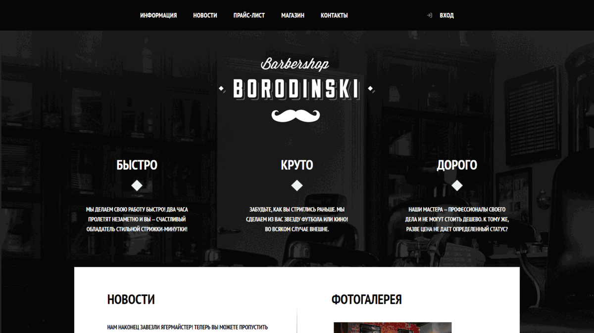

	
	<h1>OOD Barbershop</h1>

	
	
	
	 
	
	
	

 

	<a href="#-content">Content</a> •
	<a href="#-author">Author</a> •
	<a href="#-license">License</a>

***

	

***

## ♦ Content

- Popups
	- Login
		- Title
		- Description
		- Name Input Field
		- Password Input Field
		- Checkbox to Remember Me
		- Button to Restore the Password
		- Button to Log In
		- Button to Close the Pop-up Window
	- Map
		- Map Widget
		- Button to Close the Pop-up Window
- Blocks
	- Header
		- Navigation to Go to Sections
			- Information
			- News
			- Price List
			- Shop
			- Contacts
		- Button to Open the Login Pop-up Window
	- Footer
		- Contact Information
		- Links to Go to Social Networks
		- Link to Go to the Website of the Author of the Layout
- Home
	- Information
		- Advantages
			- Title
			- Decorative Element
			- Paragraph
	- News
		- Left
			- Title
			- News
				- Paragraph
				- Date
			- Link to Go to All News
		- Right
			- Title
			- Photo Gallery
			- Button to Scroll Images Backward
			- Button to Scroll Images Forward
	- Contacts
		- Left
			- Title
			- Contact Information
				- Paragraphs
				- Working Hours
			- Button to Open the Map Pop-up Window
			- Link to Go to Contacts Page
		- Right
			- Title
			- Description
			- Appointment Form
				- Date Input Field
				- Time Input Field
				- Name Input Field
				- Phone Number Input Field
			- Button to Submit the Form
- Price
	- Status
		- Title
		- Breadcrumbs
	- Information
		- Title

***

## ♦ Note

• The Web Project is Not Displayed Correctly on The Server

***

## ♦ Author

• Go to the [Author's Page](https://htmlacademy.ru) to See It

***

## ♦ License

• OOD Barbershop are Distributed Under the GPL-3.0 License